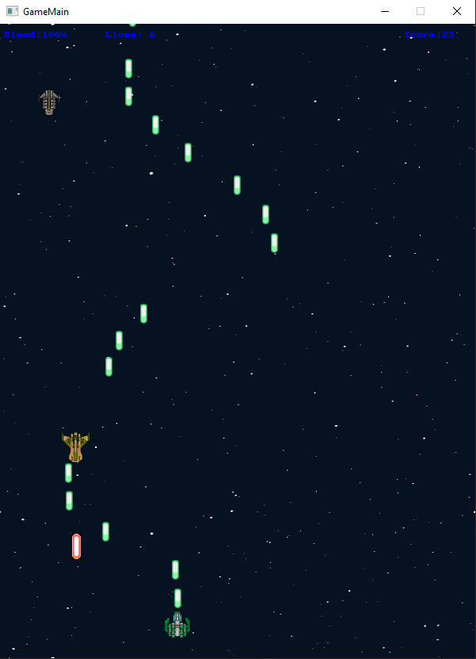
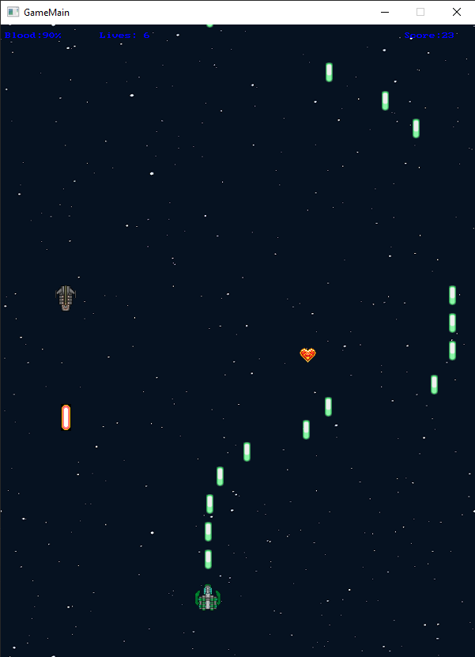
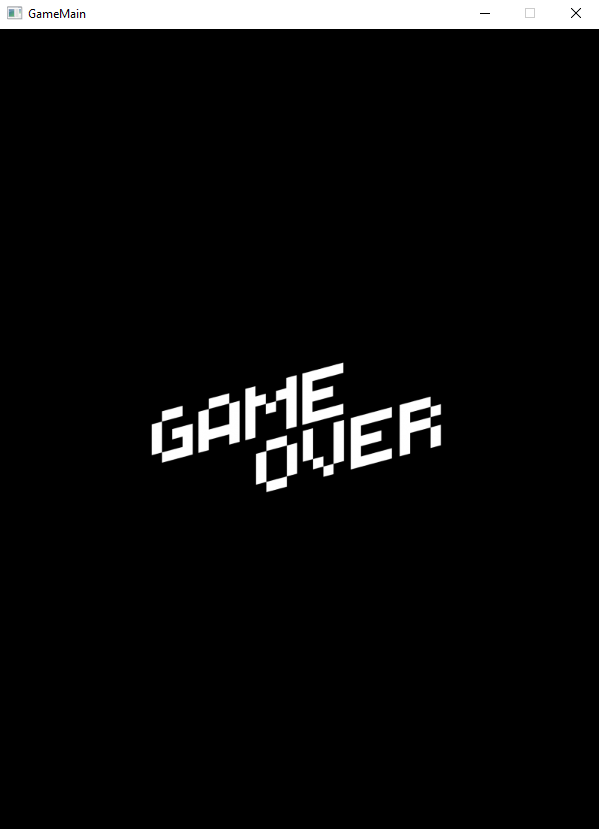

# SpaceCraft
This game was programmed in C# and made use of Swingame Library. The main idea behind this game is to utilise sprite-based objects so that we can check their locations, check the collisions between objects and move the objects easily.

To run this game, open the solution in Visual Studio, click Start and enjoy!

# Some images of the game

